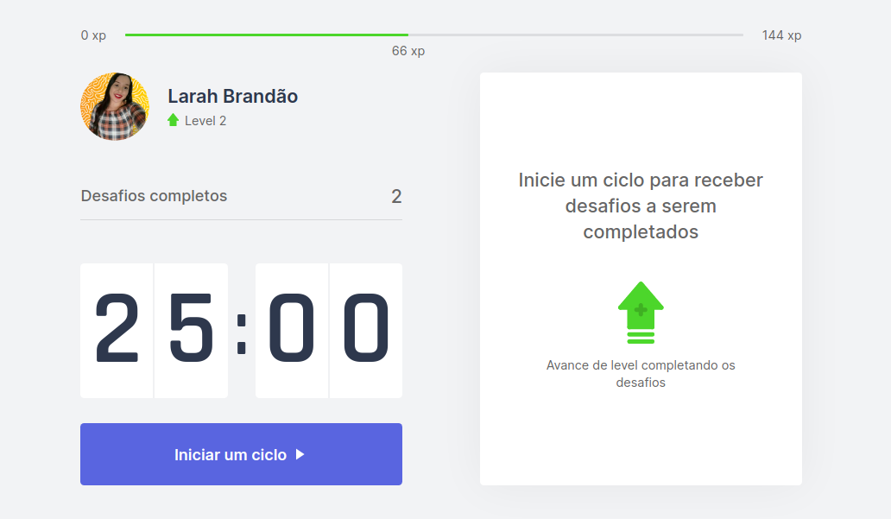
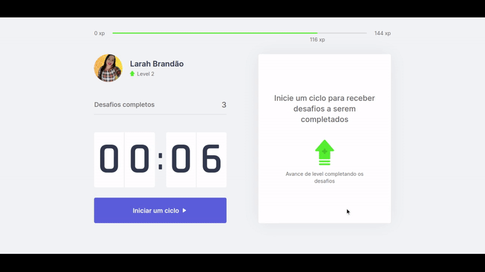

# Move.it

<h3 align="center">
    
</h3>

<p align="center">
  <a href="#technologies">Technologies</a>&nbsp;&nbsp;&nbsp;|&nbsp;&nbsp;&nbsp;
  <a href="#-preview">Preview</a>&nbsp;&nbsp;&nbsp;|&nbsp;&nbsp;&nbsp;
  <a href="#-layout">Getting started</a>&nbsp;&nbsp;&nbsp;|&nbsp;&nbsp;&nbsp;
  <a href="#-project">Project</a>&nbsp;&nbsp;&nbsp;|&nbsp;&nbsp;&nbsp;
  <a href="#-layout">Layout</a>&nbsp;&nbsp;&nbsp;|&nbsp;&nbsp;&nbsp;
  <a href="#-license">License</a>&nbsp;&nbsp;&nbsp;|&nbsp;&nbsp;&nbsp;
  <a href="#-author"> Dev </a>
</p>


<a id="sobre"></a>

## :bookmark: Sobre

O <strong>Move.it</strong> é uma aplicação Web que funciona como um Pomodoro Timer com desafios para serem cumpridos a cada 25 minutos de concentração em sua tarefa do dia. Acumule XP e suba de nível.


Essa aplicação foi construída durante a <strong>Next Level Week #4</strong> distribuída pela [Rocketseat](https://rocketseat.com.br/).</strong>




<a id="technologies"></a>

## :rocket: Tecnologias Utilizadas

O projeto foi desenvolvido utilizando as seguintes tecnologias:

- [TypeScript](https://www.typescriptlang.org/)
- [Next.js](https://nextjs.org/)
- [ReactJS](https://reactjs.org/)

<a id="-preview"></a>

## 🔥 Preview

Acesse a aplicação em produção:

[](https://move-it-larah.vercel.app/)

<a id="-layout"></a>

## 🔖 Layout

Você pode vizualizar o layout do projeto no link abaixo:

- [Layout Web](https://www.figma.com/file/ge20pu3ofMOKoliUyKx1Nl/Move.it-1.0) 

Lembre-se que você precisa ter uma conta [Figma](http://figma.com/) para acessar o arquivo.

<a id="-project"></a>

## :fire: Como usar

1. Faça um clone :

```sh
  $ https://github.com/LarahBrandao/Move.it.git
```

2. Executando a Aplicação:

```sh
  # Instale as dependências:
  $ yarn

  # Inicie a aplicação web:
  $ yarn dev


```


<a id="-license"></a>

## :memo: License

Esse projeto está sob a licença MIT. Veja o arquivo [LICENSE](LICENSE.md) para mais detalhes.

---

<h4 align="center">
   🌹 Feito por <a href="https://www.linkedin.com/in/larahbrandao/" target="_blank">Larah Brandão</a> ❤️
</h4>
